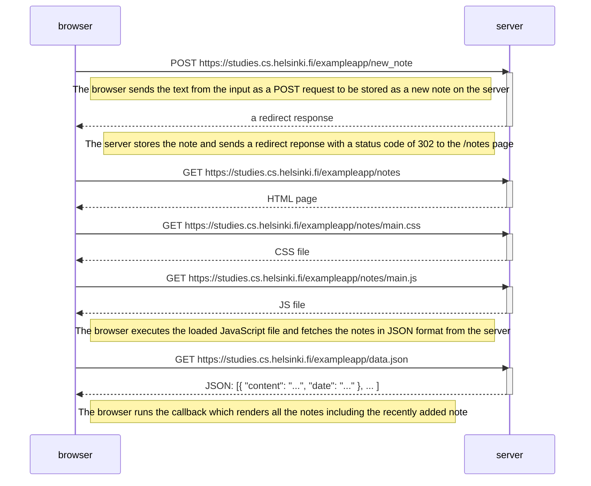

# Exercise 0.4

```mermaid
sequenceDiagram
    participant browser
    participant server

    browser->>server: POST https://studies.cs.helsinki.fi/exampleapp/new_note
    activate server

    Note right of browser: The browser sends the text from the input as a POST request to be stored as a new note on the server

    server-->>browser: a redirect response
    deactivate server

    Note left of server: The server stores the note and sends a redirect reponse with a status code of 302 to the /notes page

    browser->>server: GET https://studies.cs.helsinki.fi/exampleapp/notes
    activate server
    server-->>browser: HTML page
    deactivate server

    browser->>server: GET https://studies.cs.helsinki.fi/exampleapp/notes/main.css
    activate server
    server-->>browser: CSS file
    deactivate server

    browser->>server: GET https://studies.cs.helsinki.fi/exampleapp/notes/main.js
    activate server
    server-->>browser: JS file
    deactivate server

    Note right of browser: The browser executes the loaded JavaScript file and fetches the notes in JSON format from the server

    browser->>server: GET https://studies.cs.helsinki.fi/exampleapp/data.json
    activate server
    server-->>browser: JSON: [{ "content": "...", "date": "..." }, ... ]
    deactivate server

    Note right of browser: The browser runs the callback which renders all the notes including the recently added note
```
