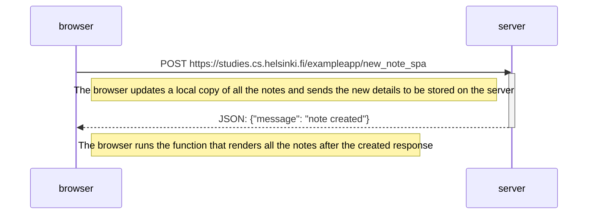

# Exercise 0.5

```mermaid
sequenceDiagram
    participant browser
    participant server

    browser->>server: POST https://studies.cs.helsinki.fi/exampleapp/new_note_spa
    activate server

    Note right of browser: The browser updates a local copy of all the notes and sends the new details to be stored on the server

    server-->>browser: JSON: {"message": "note created"}
    deactivate server

    Note right of browser: The browser runs the function that renders all the notes after the created response
```
